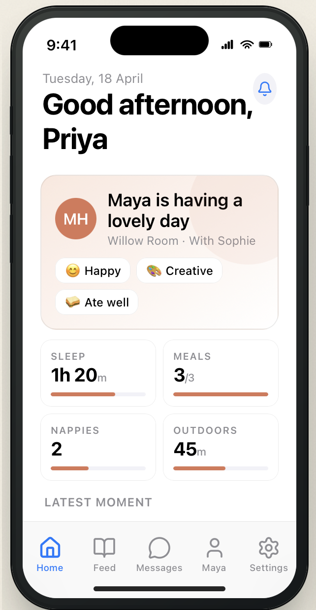
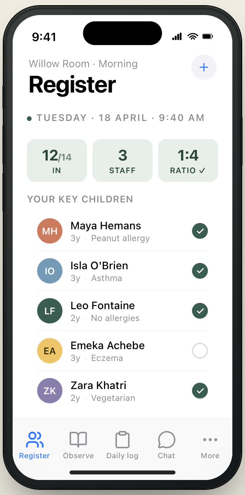
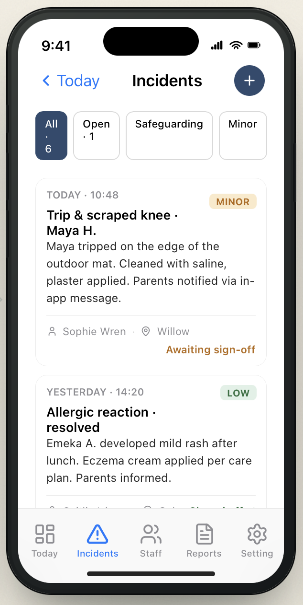

# SE4020 – Mobile Application Design & Development
## Assignment 01 — NurseryConnect iOS MVP

> **Submission Instructions:** Edit this file directly with your report. No separate documentation is required. Commit all your Swift/Xcode project files to this repository alongside this README.

---

## Student Details

| Field | Details |
|---|---|
| **Student ID** | |
| **Student Name** | |
| **Chosen User Role** | *(e.g. Keyworker / Parent / Setting Manager / Driver / Catering Staff / Marketing Coordinator)* |
| **Selected Feature 1** | |
| **Selected Feature 2** | |

---

## 01. Feature Selection & Role Justification

### Chosen User Role
*Describe the user role you have selected and their responsibilities within the NurseryConnect system.*

### Selected Features
*List and describe the two key features you have chosen to implement.*

**Feature 1:**

**Feature 2:**

### Justification
*Explain why these two features are appropriate for your chosen role and why they represent a realistic 4-week MVP scope. Explain how the two features complement each other to create a coherent user experience.*

---

## 02. App Functionality

### Overview
*Provide a brief overview of how the app works as a whole.*

### Screen Descriptions
*Document each screen in your app. Include screenshots where possible.*

**Screen 1 — Parent's Welcome Screen**

*Describe what this screen does and how the user interacts with it.*



**Screen 2 — Keyworker's Registration Screen**

*Describe what this screen does and how the user interacts with it.*



**Screen 3 — Manager's Incident Screen**

*Describe what this screen does and how the user interacts with it.*



*(Add more screens as needed)*

### Navigation
*Describe how the user navigates between screens. What navigation controller pattern did you use?*

### Data Persistence
*Describe the data persistence method you chose (e.g. UserDefaults, Core Data, SwiftData, JSON file) and why.*

### Error Handling
*Describe how your app handles errors gracefully. Give specific examples of error scenarios you have handled.*

---

## 03. User Interface Design

### Visual Design
*Describe your UI design decisions — colour palette, typography, layout, and how these choices reflect the professional childcare context of NurseryConnect.*

### Usability
*Explain how your interface is intuitive and easy to navigate. How does it provide clear feedback to the user?*

### UI Components Used
*List the SwiftUI components used in your app and describe how they were customised.*

e.g.

```
List, NavigationStack, Form, Picker, DatePicker, Sheet, Alert, ProgressView, ...
```

---

## 04. Swift & SwiftUI Knowledge

### Code Quality
*Describe how your code is structured and organised. Mention naming conventions, separation of concerns, use of MVVM or other patterns.*

### Code Examples — Best Practices

*Provide one or two examples of well-written Swift code from your project. Briefly explain what makes it a good example.*

**Example 1 — [Brief description]**

```swift
// Paste your code here
```

**Example 2 — [Brief description]**

```swift
// Paste your code here
```

### Advanced Concepts
*Describe any advanced iOS development concepts you applied, such as:*
- *Concurrency (async/await, Task)*
- *Animations or transitions*
- *Networking or API calls*
- *Custom SwiftUI views or modifiers*
- *Environment objects or observable state*

---

## 05. Testing & Debugging

### Testing
*Describe how you tested your app. Include details of any unit tests or UI tests written.*

**Unit Tests:**

```swift
// Paste a representative test here
```

**UI Tests:**

*Describe any UI test scenarios you covered.*

**Manual Testing:**

*Describe the manual test cases you carried out, including edge cases.*

### Debugging
*Describe any significant bugs you encountered and how you identified and fixed them.*

---

## 06. Regulatory Compliance Report

> This section must demonstrate your understanding of the regulatory requirements relevant to the NurseryConnect system and your chosen role and features.

### Understanding of Regulations

#### UK GDPR
*Explain the key UK GDPR obligations relevant to your chosen role and features. What personal data does your feature handle? What are the lawful bases for processing?*

#### EYFS 2024
*Explain how the Early Years Foundation Stage framework applies to your chosen features, if applicable.*

#### Ofsted
*Describe any Ofsted inspection requirements relevant to the data or records your feature manages.*

#### Children Act 1989
*Explain the safeguarding and welfare obligations under the Children Act 1989 that are relevant to your feature.*

#### FSA Guidelines
*If applicable (e.g. Catering Staff role), describe how FSA food safety guidelines apply to your feature.*

### Compliance by Design
*Explain how your iOS app's architecture, data handling, and UI design decisions reflect the regulatory requirements identified above. Where you have not implemented full backend compliance (e.g. encryption at rest, audit logging), clearly state what a full production system would need to implement.*

### Critical Analysis
*Go beyond a surface-level description. Discuss any tensions or trade-offs you identified between regulatory compliance and usability. For example: consent flows that add friction, data minimisation vs feature richness, or local persistence vs cloud backup requirements. Propose thoughtful mitigations for these trade-offs.*

---

## 07. Documentation

### (a) Design Choices
*Explain your key design decisions — UI layout, colour scheme, navigation pattern, data model structure — and the reasoning behind each.*

### (b) Implementation Decisions
*Explain your implementation decisions, including:*
- *Choice of data persistence strategy*
- *Any third-party libraries or APIs used*
- *Any simplifications or constraints made for the MVP scope*

### (c) Challenges
*Describe any technical or design challenges you faced and how you resolved them.*

---

## 08. Reflection

### What went well?
*Briefly describe what aspects of the project you are most satisfied with.*

### What would you do differently?
*Reflect on how you would approach this assignment differently if you were starting again. Consider design, planning, technology choices, and time management.*

### AI Tool Usage
*As per the submission guidelines, if you used any AI tools (GitHub Copilot, ChatGPT, Claude, etc.), attach or link the detailed prompts and responses you used below, or include them in a separate file in this repository.*

---

*SE4020 — Mobile Application Design & Development | Semester 1, 2026 | SLIIT*


